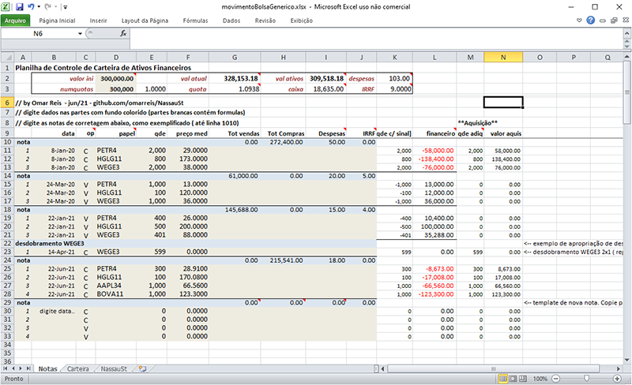
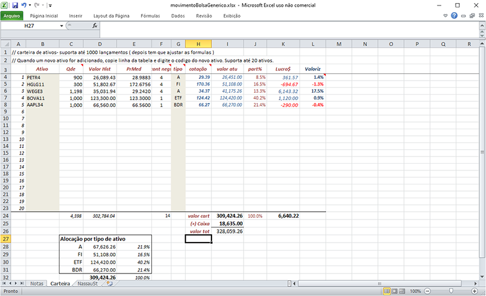

# NassauSt

Esse repositório contém arquivos e tutoriais de suporte ao app **Nassau St**.

## Sobre NassauSt
NassauSt é um app para acompanhamento do mercado financeiro e gestão de carteiras de ativos financeiros.
Multi-plataforma disponivel para **Android iOS e Windows**.

## Versão atual do app: 2.5.2 - mar-22 para Windows, Android e iOS.

Neste texto é proposto um sistema de controle de ativos que consiste em:

* planilha Excel 
* App Nassau

## Homepage
* https://www.tecepe.com.br/nassau - links para downloads.

## Market data ( cotações ) 
As cotações do **Google Finance**, através do GoogleSheets, são usadas em cálculos nas carteiras de Nassau St.
Este serviço do Google é grátis, porém na maioria dos ativos há um **delay de 15 min**. 
Se voce precisa de cotações em tempo real, consulte a enfoque ( www.enfoque.com.br )

A planilha abaixo contém a tabela de ativos "oficial" de Nassau St:

    https://docs.google.com/spreadsheets/d/1rP386BJCjW2MDa9PzYYP5OPzgeO61lG-Vo_EM8GDHho/edit?usp=sharing
  
* certifique-se de conhecer os Termos de serviço do Google 

    https://policies.google.com/terms?hl=pt-BR
    
## Series históricas de preços: **Yahoo Finance**

    https://finance.yahoo.com/
    
## Video: usando Nassau St com Excel
    

## Como controlar uma carteira de ativos financeiros ? 

Muitos investidores usam os sistemas providos pelas corretoras para controle de suas carteiras.
Alguns sistemas são bons, oferecendo várias ferramentas. 

Mas ficam sempre a desejar nos quesitos flexibilidade e integração com outros sistemas.
Além disso, ter um controle próprio das operações permite checar os cálculos da corretora.
E facilita muito integrar dados de várias instituições ( como na declaração de IR )

O sistema de controle proposto aqui consiste em uma planilha **Excel** e o app **Nassau** ( em PCs Windows e celulares).
Note que há redundância no controle das posições em carteira: Um controle no Excel e um controle no app Nassau.
De fato é uma redundância tripla, se contarmos o sistema da Corretora.

A planilha de exemplo faz o controle básico de uma carteira de ativos financeiros.
Limpe os dados de exemplo e insira seus próprios dados ( investimento e as notas de corretagem ).
As notas de corretagem vem do sistema da Corretora ( por email ou via web )

* Download da planilha de controle de ativos: https://github.com/omarreis/NassauSt/blob/main/movimentoBolsaGenerico.xlsx

## Controle da carteira

O controle de uma carteira de ativos financeiros começa com um **capital inicial** e o correspondente um certo **numero de quotas**.
Esse é o capital que vai ser investido em ativos ( ações, fundos imobiliários, ETFs, BDRs ). 

A planilha de controle é alimentada com **Notas de Corretagem** das operações na bolsa, emitidas pela corretora.
A nota contém alguns campos importantes:

* Data da nota - uma nota por dia de negociação
* Despesas ( emolumentos+corretagem+taxas+impostos exceto IRRF )
* IRRF ( imposto retido na fonte. a.k.a. dedo-duro )
* Total de compras
* Total de vendas

Além disso, cada nota contém uma ou mais operações. Cada operação tem os seguintes dados:

* Data da operação
* Código do ativo ( ex: **PETR4** )
* Tipo de Operação ( **C** ou **V**)
* Quantidade negociada
* Preço médio
* Valor da op
 
## Uso da planilha Excel

Nassau foi desenvolvido de olho na interação com planilhas Microsoft Excel.
Cada administrador de ativos financeiros tem o seu conjunto de planilhas.
A planilha the controle de exemplo, disponivel para download neste repositório contem 3 páginas (tabs):

* **Notas** - Use para incluir suas notas de corretagem, além dos dados gerais da carteira.
* **Carteira** - Posições atuais da carteira. Calculo de estatísticas agregadas. Usa cotações do app Nassau via DDE 
* **Nassau ST** - Transferencia de dados para o app, via copy-paste to texto do banco de dados ( BD ) 

dicas de uso da planilha ( p/ Windows):

* Abra o app Nassau ST e depois a planilha Excel.  
* Habilite os links DDE para ter as cotações do Nassau a planilha ( ex: valor atual ).
* Leia as dicas de uso e os comentários na planilha. 
* Use '.' como separador decimal.   
* Use letras maiúsculas no tipo de operação ( "C" ou "V") e nos CÓDIGOS de ativos.
* Digite nas células com fundo colorido (as células brancas contém fórmulas).
* Nas células de **cotação atual** utilize um link DDE para obter a cotação atual cada ativo ( ver mais abaixo )
* Ativos novos devem ter o código incluido na tabela da aba *Carteira* 
* Na aba *Notas* insira as operações em Bolsa ( i.e. as notas de corretagem ) 
* A planilha não tem células bloqueadas. Use com cuidado até entende-la.

##  Uso de cotações Em planilhas Excel ( via DDE )
Nassau St (na versão para Windows, v2.1+ ) suporta atualização de cotações via link DDE ( tecnicamente o app Nassau é um servidor dde ).

DDE é um protocolo de intercâmbio de dados entre aplicativos no Windows. Tradicionalmente é usado para alimentar planilhas Excel com cotações em tempo real. 

NassauSt permite acessar cotações dos mercados mundiais. São disponiveis ações brasileiras, ETFs, FIIs, BDRs, ADRs na B3, além de alguns ativos da NYSE e NASDAQ, indices mundiais, moedas e cryptos ( aprox 1500 ativos financeiros ).

**Exemplo de uso do DDE:**

1) No Windows abra simultaneamente os apps NassauSt e Excel.
2) Faça o download e abra a planilha de teste: 
      https://github.com/omarreis/NassauSt/blob/main/documentacaoNassauSt_DDESvr.xlsx
3) Autorize a atualização dos items da planilha.

Como Nassau atualiza as cotações a cada 5 min, as cotações na planilha são atualizadas com a mesma frequencia.

A planilha Excel de exemplo ilustra como estabelecer o link para atualização automática da planilha.

## Links de cotações
Nassau permite dois tipos de links DDE ( tópicos DDE ): valores **individuais** e **range** de valores.

**1-** Valores individuais do papel (tópico **VAL**)
 
* fórmula:   **=nassau|val!ativo.tipo**
* exemplos:  **=nassau|val!goog**    ou   **=nassau|val!IBOV.max**

A formula é case insensitive. 
   
* tipos em portugues: cod preco max min abe vol var marketcap hora pl lpa min52 max52 fech numero nome tipo moeda bolsa.
* tipos em ingles: cod price high low priceopen volume changepct marketcap tradetime pe eps low52 high52 closeyest shares name type curr bolsa.
 
As duas linguas podem ser usadas.

No caso de omitir o tipo o ultimo preço é retornado. ex: **=nassau|val!petr4**
 
**2-** Range de valores do ativo (tópico **ALL** )
Retorna todos os campos do ativo em multiplas células horizontais (range )
   
uso:
* Selecione um range de celulas horizontal com até 19 colunas       
* Digite fórmula:  **=nassau|all!ativo**  (exemplo: **=nassau|all!petr4**)
* pressione **Ctrl-Shift Enter**

## Posições em Carteira

Para cada conta é mantida uma lista de posições em carteira e inclui estátisticas de rentabilidade da posição:
* Codigo e especificação do papel
* Quantidade possuida
* Preço médio de aquiosição
* Valor de aquisição ( inclui despesas )
* Participação na carteira
* Cotação atual
* Valor atual
* Variação percentual
* Lucro/prejuízo da posição
* Prazo médio da posição
* Taxa de retorno anualizada 

## Banco de dados em texto

Nassau ST utiliza banco de dados em formato texto. Isso permite interagir com outros programas ( ex planilhas ). 
O formato do banco de dados de operações é texto separado por ';'.
Cada linha contem um objeto que pode ser tipo conta, cabeçalho de nota, execução em bolsa ou lançamento (saque-deposito)

**Conta:** 
    formato: **c;Nome;Instituicao;NumDaConta;AporteInicial;NumDeCotas**
    
    c;Jose Carlos;AçõesDoZeca;001-1;300000;300000

**Nota:** 
    formato: **n;data;TotalCompras;TotalVendas;Despesas;IRRF**

    n;08/01/2020;272400;0;50;0

**Execuções:** 
  formato: **e;data/hora;C/V;Papel;Qde;Valor;PreçoMédio**
    
    e;08/01/2020 00:00;C;WEGE3;2000;76000;38
    
Uma nota completa fica:

    n;24/03/2020;0;61000;20;5
    e;24/03/2020 00:00;V;WEGE3;1000;36000;36
    e;24/03/2020 00:00;V;HGLG11;100;12000;120
    e;24/03/2020 00:00;V;PETR4;1000;13000;13
    
Nassau ST permite copiar ou colar uma lista de objetos, para permitir interação com outros sistemas (p.e. Excel) usando o clipboard do dispositivo. 

                Nassau St   <------------> Planilhas Excel, e-mail, 
               
Na formatação em texto, observar: 
  1) Usar '.' como separador decimal  
  2) Não usar separador de milhar (Numeros reais devem ter o formato '1234.56') 
  3) Data no formato 'dd/mm/aaaa hh:mm'
  4) Códigos em letras maiúsculas

Para inserir objetos no app, na página de portfolio:

1) Clique **Menu** 
2) Com as operações já no clipboard do dispositivo, aperte **Cola objetos**. Note que as operações são inseridas na conta selecionada no momento. Certifique-se de selecionar a conta correta antes de colar.

Para copiar dados do programa, se o banco de dados estiver em texto não encriptado, na página do portfolio, clique o botão DB, selecione o texto desejado e clique **Copy** ( **Ctrl-C** no Windows ).

## Facebook

Novidades e dicas do app são publicadas nesta página no FB: 

   https://www.facebook.com/Nassaust-101122458817195
   
## Github

Esse repositório com dicas, planilhas de exemploe outros arquivos de suporte ao app.

   https://github.com/omarreis/NassauSt

## download ou update do app NassauSt: 

versão atual: 2.5.2 - released mar/22

* para Windows: https://www.tecepe.com.br/nassau/download   ( requer registro básico de usuário )
* para iOS:     https://apps.apple.com/us/app/nassau-st/id1093819633   - na AppStore
* para Android: https://play.google.com/store/apps/details?id=com.embarcadero.Nassau  - no Google Play 

## Fórmulas

Nassau permite criar fórmulas com atualização automática. As formulas podem ser associadas a um código de ativo, de modo que podem aparecer na pagina de cotação ou em outras fórmulas. Permite fazer conversão de moeda, soma de ativos, arbitragens etc. Exemplos de formulas:

* 10 * APPL+5 * GOOG+5 * FB     ( carteira simples dde ações )
* BTCBRL/BTCUSD           ( retorna o dólar usado no câmbio de bitcoin ) 
* NVDA*USDBRL/NVDC34/50   ( arbitragem entre stock e BDR ) 
* EURUSD*USDBRL           ( valor do EUR em R$ ) 
 
Além disso voce pode usar funções pre-definidas, semelhantes às de planilhas (precedidas de @):
* datas no formato "31/12/2000"
* @sqrt()  - raiz quadrada
* PETR4/USDBRL -    petr em dolar 
* @hora em numero real ( em horas )
* @minuto  -  minutos desde meia noite
* @Trunc() e @Frac()
* @if(1>2,1,2)  - condicional
* 1.41421359^2   - potência

